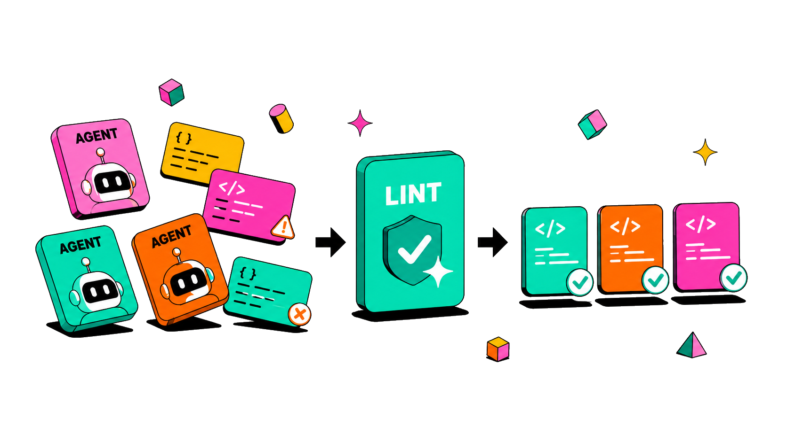

<div align="center">



[](https://github.com/CorrectRoadH/harness-lint/actions/workflows/ci.yml)
[](https://github.com/CorrectRoadH/harness-lint/releases)
[](Cargo.toml)
[](https://github.com/CorrectRoadH/homebrew-tap)

[English](README.md) · [简体中文](README.zh.md) · [日本語](README.ja.md) · [한국어](README.ko.md)

</div>

> **コーディングエージェントのための Lint Driven Development** — AI が指示を無視したら、その修正を高速で厳格な lint ルールに変え、同じ失敗を繰り返させない。

harness-lint は Harness Engineering のための次世代 lint ツールです。vibe coding では、何度修正しても、`AGENTS.md` に指示を書いても、AI がその指示を無視してしまうことがあります。このツールは Lint Driven Development によってその問題を解決します。ユーザーが AI Agent に「やってはいけないこと」を伝えたら、まずそれを固定された lint ルールに変換し、高速で厳格なチェックによって同じ失敗を防ぎます。

従来の lint ツールと比べて、harness lint のルールは人間が読みやすく、理解しやすい形で書けます。また、AI coding のワークフローとベストプラクティスに合わせて設計されています。

## インストール

```sh
brew install getgrit/tap/grit
brew install CorrectRoadH/tap/harness-lint
```

対応する Codex skill をインストールするには:

```sh
npx skills add CorrectRoadH/harness-lint
```

## Agent 用にリポジトリを初期化

```text
READ https://raw.githubusercontent.com/CorrectRoadH/harness-lint/refs/heads/main/INIT.md and install harness lint for this code repo
```

## Agent プラグイン（Claude Code と Codex）

`AGENTS.md` に書いた静的な指示は一度しか読まれず、agent が実際に手を動かす瞬間からは遠い場所にあります。[`plugins/`](plugins/) のプラグインは代わりにライフサイクルフックを使い、セッションごとに Lint Driven Development のガイダンスを再注入し、プロンプトのたびに `harness-lint check --changed` を実行して**実際の現在の違反**を agent に渡し、次の行を書く前に修正させます。

Claude Code:

```text
/plugin marketplace add CorrectRoadH/harness-lint
/plugin install harness-lint@harness-lint
```

Codex:

```text
codex plugin marketplace add CorrectRoadH/harness-lint
codex plugin add harness-lint@harness-lint
```

どちらも `/harness-lint-capture` コマンドを同梱しています。セッション中のフィードバックを見直し、再利用できる指摘をルールに落とし込みます（LDD のもう半分）。詳細は [`plugins/README.md`](plugins/README.md) を参照してください。

## よく使うコマンド

```sh
harness-lint check --changed
harness-lint check --all
harness-lint rule list
harness-lint search "python typing"
harness-lint list --available
harness-lint install python
harness-lint install python-pep8
harness-lint outdated
harness-lint update
harness-lint remove python
```

## 設定デモ

`harness.toml` は、どのファイルをチェックするか、ローカルルールをどこに置くか、どのルールパックをインストールするか、どのルール結果を別扱いするかを制御します。

```toml
# 生成された設定に表示される、任意のプロジェクト名。
[project]
name = "my-service"

# デフォルトの lint 動作。
[lint]
# warn は問題を報告し、error はチェックを失敗させます。
default_level = "warn"
# `harness-lint check --changed` で使用します。
changed_base = "origin/main"
# 実行間でファイル単位の結果を再利用します。
cache = true

# プロジェクト所有のローカルルールファイル。
[rules]
local = ["rules"]

# インストールして復元する共有ルールパック。
[packs]
typescript = "github:CorrectRoadH/harness-lint@main#packs/typescript"

# ルールファイルを編集せずに、1 つのルールのレベルを変更します。
[overrides]
"typescript.no-console-log" = "error"

# 特定のルールをオフにします。
[disabled]
rules = ["typescript.no-explicit-any"]

# すべてのルールでこれらのパスをスキップします。何もスキャンしません。
[ignore]
paths = ["dist/**", "coverage/**"]

# ほとんどのルールがスキップすべきだが、一部のルールが必要とする名前付きファイル領域。
# default_rules = false はこれを default 領域から外すため、通常の
# ルールはスキャンしません。provides は、共有パックのルールがあなたの
# レイアウトをハードコードせずに対象にできる、移植可能な概念名を列挙します。
[file_sets.generated]
paths = ["backend/gen/**/*.pb.go", "packages/proto/gen/**"]
default_rules = false
provides = ["generated"]

# 一致するパスに対してのみ 1 つのルールを隠します。ほかのルールはそれらのファイルを引き続きチェックします。
[[exceptions]]
rule = "typescript.no-console-log"
paths = ["src/generated/**"]
reason = "Generated SDK code is checked in and emits debug output during local mocks."
```

ルールは frontmatter の `runs_on` で領域にオプトインします。`runs_on` がない場合、ルールは **default** 領域（`default_rules = false` のセットが要求しない、可視のすべて）をスキャンします。

```markdown
---
id: local.proto-no-id-getter
title: Proto messages must generate GetId
language: go
runs_on: ["generated"]   # generated 領域のみ。通常のソースは決してスキャンしない
---
```

### 設定がどう合成されるか

harness-lint は 3 つの独立した質問に、この順番で答えます。それらを分けておくことが、上記のノブを予測どおりに重ねられる理由です。

1. **ルールはオンか？** パックのデフォルト無効リストと `[disabled]` はルールを完全にオフにします。`[overrides]` はその重大度を変えるだけです。オフのルールは残りをスキップします。
2. **ルールはどのファイルをスキャンするか？** リポジトリから始めて、優先順位の順に適用します。
   - 構造的な除外 — `.git`、`node_modules`、`target`、`.harness`、ルールディレクトリ、および `.gitignore` 対象のファイルは決してスキャン対象にならず、これを上書きするものはありません。
   - `[ignore].paths` — すべてのルールから除外されます。何も再度オプトインできません。
   - **file sets** — 残ったファイルが分割されます。`default_rules = false` のセットは `default` 領域から外れ、ルールは `runs_on` でそのセット（またはそれが `provides` する概念）を名指ししたときだけ到達できます。`runs_on` のないルールは `default` をスキャンします。
   - ルールの言語と GritQL の `$filename` 述語が、残りをさらに絞り込みます。
3. **結果は報告されるか？** `[[exceptions]]` は、一致するパスでスキャン済みルールの診断を隠します。

`runs_on` は排他的なスコープであり、裏口ではありません。ルールがデフォルトで閉じたファイルセットに到達するのは、それを要求したからであり、そのルールだけです。セットの *位置*（`paths`）は `harness.toml` でプロジェクト所有ですが、ルールの *対象* は移植可能な名前（`generated`）です。そのため共有パックのルールは、生成コードがどこにあるかを知らなくても `runs_on: ["generated"]` を出荷でき、あなたは 1 つの `provides` で両者をつなぎます。ファイルセットは自由にリネームできます。その `provides` が概念を列挙し続ける限り、すべてのパックルールは動き続けます。通常のソースと領域の両方が必要ですか？ 両方を列挙します: `runs_on: ["default", "generated"]`。

harness-lint は自身の設定の整合性もチェックします。存在しなくなった `[[exceptions]]` / `[ignore]` / `[file_sets.*]` のパス、`[ignore]` と重複する、またはパスを持たないファイルセット、未知のルールを名指しする `[disabled]` / `[overrides]` のエントリ、そして `runs_on` が何も提供しないファイルセットや概念を名指しするすべてのルール — これらはすべて報告されます（デフォルトは warn、ファイルセット / 実行ターゲットの構造的エラーは error。id ごとに `[overrides]` で調整します）。

## ローカルルール

プロジェクト固有のカスタムルールは、デフォルトでは `rules/*.md` に置きます。別の場所に置きたい場合は、`harness.toml` で設定できます。

```toml
[rules]
local = ["custom-rules"]
```

`harness-lint rule create` は、設定された最初のローカルルールディレクトリに新しいルールを書き込みます。ローカルルールは作成時点で実行可能な GritQL を含める必要があります。

```sh
harness-lint rule create "Avoid print debugging" --language python --grit '`print($value)`'
```

フィードバックを信頼できる GritQL pattern として表現できない場合は、harness-lint rule を作成しないでください。その制約は agent 指示、review checklist、またはプロジェクト文書に残してください。

ルールを作成したら、広い範囲のチェックに頼る前に、そのルールだけを実行して期待するファイルが報告されることを確認してください。`check` に path を渡して rule scope を擬似的に作らないでください。特定のファイルだけに適用する必要がある場合は、GritQL の `$filename` で表現します。

```sh
harness-lint rule verify local.no-print
harness-lint check --all --rule local.no-print
```

ルールファイルの例:

````markdown
---
id: local.no-print
title: Avoid print debugging
language: python
level: warn
skill: tdd
tags: [local, python]
---

# Avoid print debugging

Use logging instead of committed print calls.

```grit
language python
`print($value)`
```

## Bad

```python
print(user)
```

## Good

```python
logger.info("user=%s", user)
```
````

ルールを特定のファイルに限定したい場合は、GritQL の `$filename` 条件を直接書きます。

```grit
`console.log($value)` where {
  $filename <: r".*src/.*\.ts",
  !$filename <: r".*\.test\.ts"
}
```
